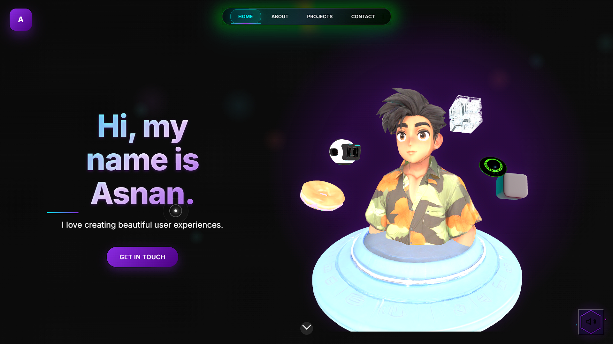

# 🚀 MY Portfolio | AI/ML Developer & UX 3D Designer



A cutting-edge, interactive portfolio website showcasing my expertise in AI/ML development and UX design. Built with performance optimization and modern web technologies.

[](https://asnanp.netlify.app)
[](LICENSE)

## ✨ Features

- **Responsive Design** - Fluid layouts that adapt to any device with device-specific optimizations
- **Interactive 3D Elements** - Immersive Three.js powered 3D models and animations
- **Performance Optimized** - Adaptive loading based on device capabilities and network conditions
- **Accessibility Focused** - WCAG compliant with keyboard navigation and screen reader support
- **SEO Enhanced** - Structured data, meta tags, and optimized content for search engines
- **Progressive Web App** - Installable on devices with offline capabilities
- **Custom Cursor Effects** - Interactive cursor with performance-aware animations
- **Scroll Animations** - Intersection Observer powered reveal animations
- **Dark Mode Support** - System preference detection for color schemes

## 🛠️ Technologies

### Frontend
- HTML5, CSS3, JavaScript (ES6+)
- Three.js for 3D rendering and animations
- Vanilla Tilt.js for card effects
- Custom performance monitoring and optimization

### Performance
- Lazy loading for images and assets
- Adaptive rendering based on device capabilities
- Network-aware resource loading
- Optimized animations with requestAnimationFrame

### Deployment & Tools
- Netlify for hosting and continuous deployment
- Git for version control
- Responsive testing across multiple devices

## 🖥️ Projects Showcased

### Ad Detector Prediction
Machine learning model that predicts whether an online ad will be clicked based on user behavior patterns and ad characteristics.

### AI Art Generator
Create stunning AI-generated artwork using advanced machine learning models with dynamic style transfer and intelligent image synthesis.

### Smart Portfolio Analyzer
AI-powered investment portfolio analyzer with real-time market insights and personalized investment recommendations.

## 🚀 Getting Started

### Prerequisites
- Modern web browser (Chrome, Firefox, Safari, Edge)
- Git (optional, for cloning)

### Installation

1. Clone the repository
   ```bash
   git clone https://github.com/Asnanp/Portfolio.git
   ```

2. Navigate to the project directory
   ```bash
   cd portfolio
   ```

3. Open index.html in your browser
   ```bash
   open index.html   # Mac
   start index.html  # Windows
   ```

### Development

To modify the 3D models:
1. Edit the model files in your preferred 3D software
2. Export as .glb or .gltf format
3. Replace the existing models in the project

## 📱 Performance Optimization

This portfolio automatically adapts to your device capabilities:

- **High-end devices**: Full 3D models, particles, and animations
- **Mid-range devices**: Optimized 3D models with reduced effects
- **Mobile/low-end devices**: Simplified animations and fallback images
- **Reduced motion**: Respects user preferences for reduced motion
- **Slow networks**: Loads lightweight assets and disables heavy animations

## 🌐 Deployment

This site is deployed on Netlify with continuous deployment from the main branch.

Visit: [https://asnanp.netlify.app](https://asnanp.netlify.app)

## 📞 Contact

Feel free to reach out through any of these channels:

- 📧 **Email**: [asnanp875@gmail.com](mailto:asnanp875@gmail.com)
- 💼 **LinkedIn**: [linkedin.com/in/Asnanp1](https://linkedin.com/in/Asnanp1)
- 🐙 **GitHub**: [github.com/Asnanp](https://github.com/Asnanp)
- 🌐 **Website**: [asnanp.netlify.app](https://asnanp.netlify.app)

## 📄 License

This project is licensed under the MIT License - see the [LICENSE](LICENSE) file for details.

## 🙏 Acknowledgments

- Three.js community for the amazing 3D web graphics library
- Netlify for the seamless hosting and deployment
- All the open source libraries that made this project possible
